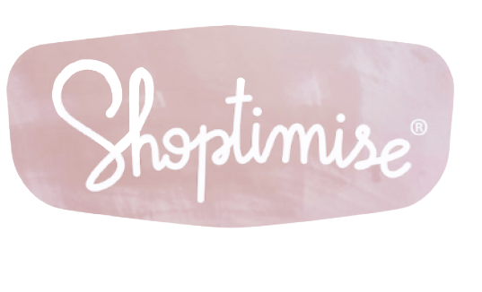

 
    

<h2 align="center"> "Shoptimise" is an eCommerce app </h2>

[Mockup in Figma (with Prototype) 🔗](https://www.figma.com/file/pFNcj0Ny3H5mCRsZIZtRv3/Shoptimise?type=design&node-id=0%3A1&t=5YUintZE3MNPmJTy-1)  

Various plugins were used in the design. (e.g Material Design Icons,User Profile..)  

---

### Shoptimise is an eCommerce app where one can buy and sell new/old products/goods. The main features will be:

- Login Options 
  - Google Login
  - Email/Password Login
- Profile, Edit Profile, Change Password.
- Chats - Chat between buyer/seller
- Ads List with Search and Filter
- Add the Ad to Favorite
- Buy & Sell Products

 
    - The application is developed with "Kotlin" in "Android Studio".

 
   - All authentication, registration and data operations are done with "Firebase".   

